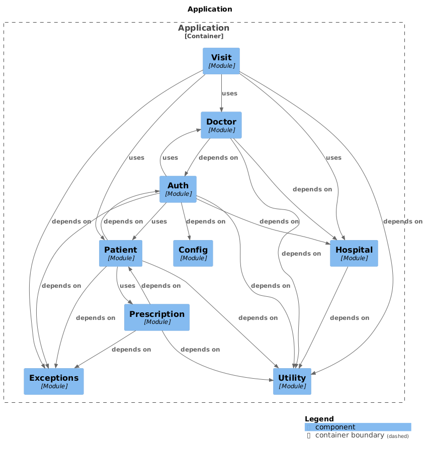

# Hospital service

This project exposes an API for private medical institutions to operate with their patients, allow patients operate on
their visits and doctors to track visits and issue prescriptions.

There are be 3 roles in this project: admin, doctor, patient.

### Architecture

### Admin

- Admins are predefined and seeded to a database by a tech lead.
- Admins would have access to admin panel where they can register hospitals and see the overall info about the system.

### Doctor

- Only doctor can issue a presription for a patient.

### Patient

- Patients are registered by themselves.
- Patients can manage their visits to doctors on certain date and time.
- Patients can access their prescriptions.

#### Team

- Bohdan Shevchenko
- Maksym Polishuk
- Ilya Dubov
